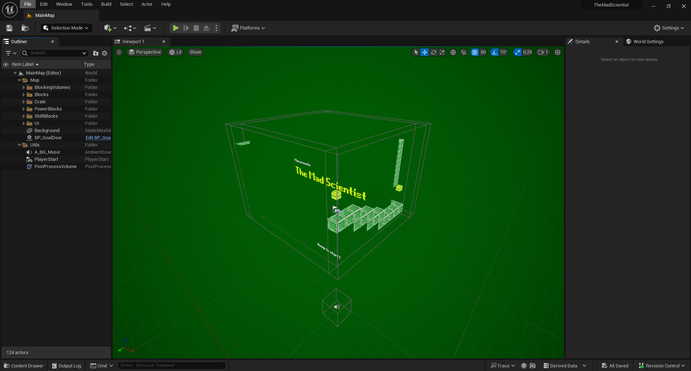
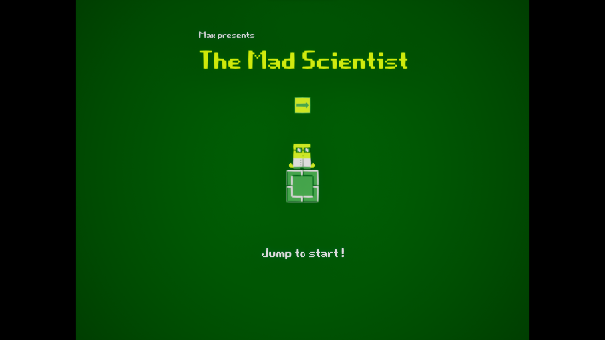
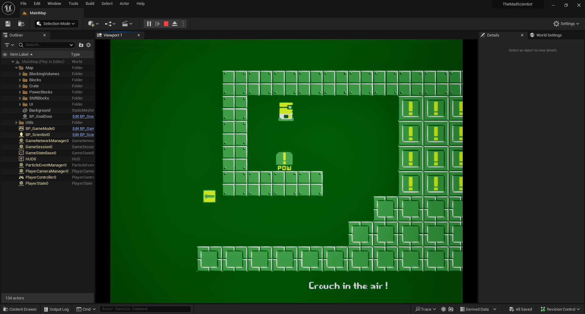
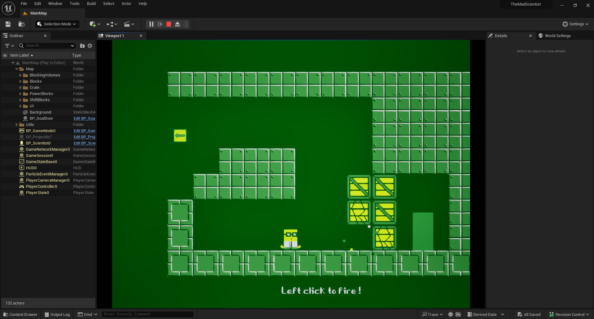

# TheMadScientist

## Overview
TheMadScientist is a 2D platformer game, the objective is to progress through the level using abilities like diving and potions, which allow firing projectiles. It's the result of a 8h course made by Gamedev Teacher that I follow to improve my skills in UE5.
> Made in 1 week (Thanks to the formation of Gamedev Teacher at https://www.youtube.com/@GamedevTeacher)

## Table of Contents
- [Features](#features)
- [Technologies Used](#technologies-used)
- [Demo](#demo)
- [License](#license)

## Features

- **2D game**: Engage in a classic side-scrolling platformer experience, navigating through level and overcoming obstacles.

- **Niagara System**: Utilize the advanced particle system of Niagara to create stunning visual effects and dynamic environments.

## Technologies Used

- **UE5**: UE5 is a powerful and versatile game development engine known for its cutting-edge graphics, realistic physics, and robust game creation tools. It provides an immersive environment for developers to bring their visions to life.

- **Blueprints**: Visual scripting system simplifying game development, enabling rapid prototyping and collaboration.

## Demo

## License

This project is licensed under the MIT License - see the [LICENSE.md](LICENSE.md) file for details.